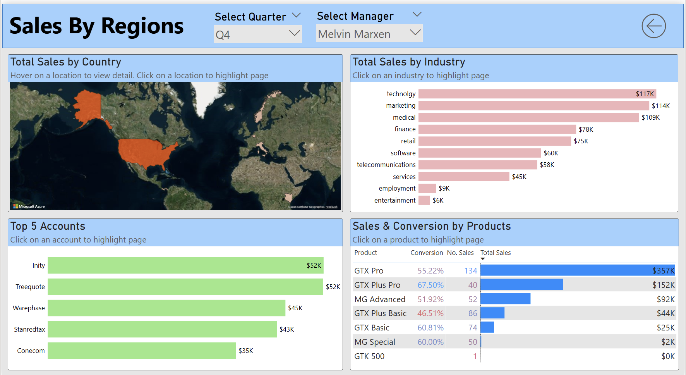
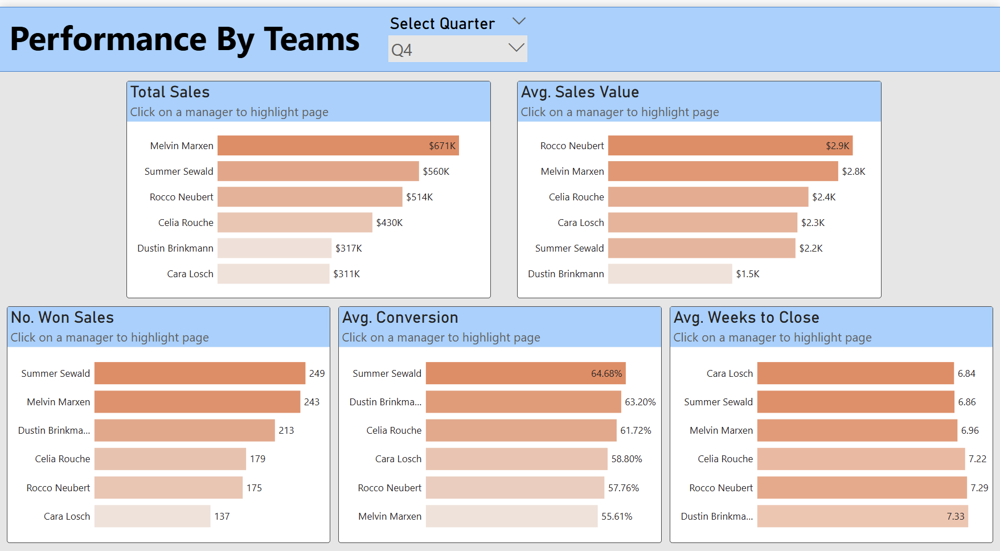

# CRM Sales Performance Dashboard
# Project Overview
This project delivers an end-to-end Business Intelligence solution that transforms raw CRM data into actionable insights for MavenTech - a U.S.-based enterprise hardware company. The dashboard enables managers to evaluate performance across individuals, products, customers, and teams using interactive and intuitive Power BI reports.

Dataset Source: [CRM Sales Opportunities on Maven Analytics](https://mavenanalytics.io/data-playground/crm-sales-opportunities)

Project Link: [Project Page at Maven Analytics](https://mavenanalytics.io/challenges/maven-sales-challenge)

GitHub Link: [GitHub Repo](https://github.com/Benzxje/Maven-Sales-Challenge/tree/main)

Source File: [Power BI File](https://github.com/Benzxje/Maven-Sales-Challenge/blob/main/Sales%20Analysis.pbix)

# Business Scenario

MavenTech recently deployed a new CRM platform but struggled to turn the collected data into meaningful insights. Sales managers lacked visibility into:
- Quarterly performance trends
- Individual agent performance
- Product-level contribution
- Team-level comparisons
  
To address this, I developed a multi-page Power BI dashboard that allows managers to analyse performance from three perspectives:
- Sales representatives
- Products, industries, and customers
- Sales teams (strategic comparison)

This solution provides the visibility needed for performance evaluation, forecasting, and strategic decision-making.

# Assumptions

- Sales managers require both individual and team-level performance monitoring.  
- Teams are allowed to compare performance across the business.  
- Quarterly performance tracking is essential for:
  - Target evaluation  
  - End-of-quarter sales pushes  
- Dashboards must be easy to interpret, supported with tooltips and intuitive visuals.

# Objective
The main objective is to create an interactive dashboard that sales managers can use to answer the following questions:

- How is the team performing this quarter?
- Which sales agents are excelling or need support?
- How do teams compare to one another and to company averages?
- What are the quarter-over-quarter (QoQ) trends?
- Which products and customers generate the highest revenue?
  

# Dataset

This dataset, available on Maven Analytics, contains B2B sales opportunities from a CRM database for a fictitious company, MavenTech, which sells computer hardware to large businesses. The dataset includes information on:

- accounts: Account details of clients including company name, industry, year established, number of employees, annual revenue,location, and parent company.
- products: Details of products offered including product name, series, and sale price.
- sales_pipeline: Records of sales opportunities with details including sales agent, product name, company name, sales pipeline stage, date of first engagement, date of closing a deal, and revenue.
- sales_teams: Details of each sales agent including name, name of manager, and regional office.
  
The dataset covers the period from October 2016 to December 2017 and supports detailed analysis of revenue performance, pipeline health, individual productivity, product effectiveness, sector profitability, and team-level comparisons.


# Data Preparation

The data model was relatively clean; however, several important preprocessing steps were required to ensure accuracy and analytical reliability:

- The product name **"GTXPro"** in the `sales_pipeline` table was standardized to **"GTX Pro"** to match the naming convention in the `products` table. This was handled using **Find & Replace in Power Query**.
- Engaging deals without close dates were properly handled to prevent incorrect quarter assignments.
- The missing values within the dataset are expected occurrences and should be retained in their current state.


# Calculated Fields & Measures

The following calculated fields and measures were created using **DAX** to support the dashboards:

- Total Sales, Last Quarter Sales, Company Average Sales 
- Won Deals, Last Quarter Won Deals 
- Conversion Rate 
- Average Sales Value, Last Quarter Average Sales Value, Company Average Sales Value 
- Weeks to Close, Last Quarter Weeks to Close, Company Weeks to Close 
- Engaging Deals, Proposing Deals, Lost Deals
- Potential Sales from Engaging Deals

Some of the DAX codes:

- Total Sales: 
```
Total Sales = Sum(sales_pipeline[close_value])
```

- Conversion Rate:
```
Conversion = 
DIVIDE(
    CALCULATE(
        COUNTROWS(sales_pipeline),
        sales_pipeline[deal_stage] = "Won"
    ),
    COUNTROWS(sales_pipeline)
)
```
- Weeks to Close:
```
Avg Week to Close = 
AVERAGEX(
    FILTER(
        sales_pipeline,
        sales_pipeline[deal_stage] = "Won"
            && NOT ISBLANK(sales_pipeline[close_date])
    ),
    DATEDIFF(
    sales_pipeline[engage_date],
    sales_pipeline[close_date],
    WEEK
)
)
```


# Data Modeling
A dedicated **Date Table** was created to serve as the central time dimension for the entire model. It drives all official time intelligence calculations using **close_date** as the primary reference. This enables:
- Quarter-based filtering
- Quarter-over-Quarter (QoQ) comparisons
- Year-over-Year and trend analysis
- Consistent time-based KPI calculations across all dashboards


To construct a unified analytical fact table, the following merges were performed:

- The `sales_pipeline` table was merged with the `products` table using the **product** field.
- The `sales_teams` table was merged with `sales_pipeline` through the **sales_agent** field.
- The `accounts` table was merged with `sales_pipeline` using the **account** field.
- All dimension tables (`accounts`, `products`, `sales_teams`, and `Date Table`) filter the `sales_pipeline` table through **one-to-many** relationships.

The resulting data model looks like this:


 

# The Dashboard 
## 1. Team Sales Performance

This page provides an immediate overview of how the team is performing in the current quarter. It is designed to help managers quickly identify trends, strengths, and potential performance issues.

Managers can:

- Select a specific sales agent to instantly drill into their individual KPIs.
- Sort metrics to see top performers or identify team members who may need additional support.
- Use navigation buttons to jump directly to Sales by Region or Engaging Sales Opportunities for deeper analysis.

The Performance by Agent table is fully interactive:
- Clicking an agent’s name filters the entire page to show KPIs specific to that agent. Column headers support sorting, allowing managers to compare agents across different performance dimensions.

Two dropdown slicers — Quarter and Manager — are included to enable flexible filtering across time periods and teams.


## 2. Engaging Sales Opportunities

This page is focused on pipeline analysis and gives managers a detailed view of all ongoing opportunities.

It helps them to:

- Review all actively engaged opportunities and their potential sales value.
- Filter by sales agent to understand individual pipeline strength.
- Identify high-value opportunities that may require strategic follow-up.
- Support weekly strategy discussions and deal reviews.

A tile slicer for Sales Agent enables quick filtering to a specific team member’s pipeline.
A dropdown slicer for Manager allows viewing opportunities by team.

Selecting an agent dynamically filters the table to show only their opportunities, helping managers evaluate both quantity and quality of deals in progress.


## 3. Sales by Region

This dashboard provides geographic and segment-based insights, helping managers understand where revenue is coming from and which markets or sectors are driving performance.

It allows users to:

- Identify high-performing countries and industries.
- Analyze product performance across different regions.
- Use cross-highlighting to explore relationships between location, product category, and final sales outcomes.
- Two dropdown slicers — Quarter and Manager — are included for easy filtering across teams and time.

All visuals interact with one another:
- Selecting a region, product, or industry dynamically highlights related data across every chart on the page.

This page is especially useful for territory planning, market strategy, and identifying underserved regions.



## 4. Performance by Teams

This page helps managers evaluate how their team is performing relative to other teams and to the company average.

It enables them to:
- Compare teams across key metrics such as total sales, conversion rate, deal value, and weeks to close.
- Spot both overperforming and underperforming teams.
- Understand whether performance gaps are isolated to individuals or reflect broader team trends.
- Benchmark results at the organisation level to support decision-making.

A dropdown slicer for Manager allows filtering performance views by team.

This page is valuable for leadership reporting, performance reviews, and resource allocation planning.



# Key Insights / Findings

## Team & Individual Performance

- Strong performance disparities exist between sales agents, especially in team Melvin and Celia.
- Some agents close deals faster but with lower average value, while others close fewer but larger deals (Violet in Cara's team had 122 sales with a total of 123K, which is much lower than the average sales value).
- Managers can clearly see who needs coaching in conversion or pipeline generation (In Dustin's team, the conversion rate in 2017 of Lajuana is 40%).
  
## Product & Market Insights

- Certain product series generate consistently higher revenue across multiple regions (GTX Pro and GTX Plus Pro).
- Some regions show high engagement but low conversion - indicating follow-up or pricing issues.

## Pipeline Health
- Several high-value opportunities remain in an “engaging” stage for extended periods.
- Managers can quickly detect stalled deals and intervene early (Several engaging deals from 2016 that haven't been closed).

## Team Benchmarking
- Some teams outperform the company average across most KPIs (Team Rocco appeared to have to highest average sales value and conversion rate) .
- Underperforming teams often lag in conversion rates rather than quantity of deals (Team Melvin had the most sales and number of won sales but they had the lowest conversion rate across all teams).

# Limitations of the Analysis
- Time period is fixed at 2016–2017; recent or real-world trends are not included.
- Some agents do not appear in the pipeline table (assumed new hires).
- The dataset includes the final deal value (close value) but not quantity sold or product breakdown, limiting deeper analysis.
- Data only reflects CRM-recorded activities - offline or informal activities aren't captured.


# Conclusion
This project delivers a complete Business Intelligence solution that helps MavenTech sales leaders:
- Understand team and individual performance at a glance
- Analyse pipeline quality and identify stalled or high-value opportunities
- Explore regional and industry performance to guide territory planning
- Compare team performance against organisation benchmarks
- Make data-driven decisions around coaching, resource allocation, and strategy

Overall, the dashboard is fully interactive, filter-driven, and designed to support both strategic reviews and day-to-day decision-making.
